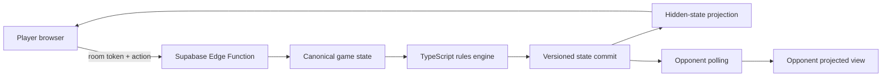

# SHOW YOUR HAND

> **DROP. PICK UP. ATTACK. DEFEND. BUT NEVER SHOW YOUR HAND.**

[](https://github.com/BTheCoderr/show-your-hand/actions/workflows/build-netlify-artifact.yml)

**Beta 0.1.0** · React + TypeScript · Supabase · Netlify

SHOW YOUR HAND is an original competitive card game being developed as both a physical tabletop game and a polished browser game.

**Play:** https://show-your-hand.netlify.app

## Product snapshot

The browser edition now has two distinct play paths:

| Area | Current beta |
| --- | --- |
| Solo | 1 human vs. 1–5 CPU opponents |
| Online | Private server-authoritative 1v1 |
| Onboarding | Interactive 2-minute tutorial + Beginner Mode |
| Match flow | First to 5 points, round winner presentation, rematch |
| Mobile | Touch gestures, responsive table, installable PWA |
| Persistence | Solo saves, online reconnect, local no-account stats |
| Product shell | About, Privacy, Beta Terms, Feedback |
| Accessibility | Reduced-motion support, readable action feedback |

## Why this project is more than a card-game UI

SHOW YOUR HAND is built as a stateful multiplayer product, not a static game demo. The current beta includes:

- a deterministic 70-card rules engine
- touch-first card interactions
- paced CPU decision presentation
- hidden-information multiplayer
- versioned online state
- server-side action validation
- private room credentials
- reconnectable player seats
- ready/rematch state machines
- player and match statistics
- PWA/offline solo support
- product/legal/feedback pages
- automated engine tests and production builds

## The deck

**70 cards total**

- 40 numbered cards — Orange, Blue, Green, Purple 1–5 × 2
- 10 Blank
- 5 Show Your Hand
- 5 Drop Color
- 5 Skip
- 5 Shuffle

## Core turn loop

**DROP → RESOLVE → PICK UP**

Players work back toward five cards while building a scoring hand and disrupting opponents.

## Scoring

| Hand | Points |
| --- | ---: |
| Mixed numbered 1–5 | 1 |
| Five cards with the same number | 2 |
| Five cards with the same color | 3 |
| Same-color 1–5 | 4 |

First player to **5 points** wins the match.

## Player experience

The current UI includes:

- opening deck-shuffle animation
- active-turn glow and move notices
- center-table special-card presentation
- swipe-up card play
- swipe-down eligible discard pickup
- visible defense/reversal flows
- enlarged winning-hand reveal
- “Why this hand won” explanation
- prominent +1 / +2 / +3 / +4 scoring moment
- sound + haptic feedback toggle
- no-clock Beginner Mode
- action history
- full rules panel
- interactive tutorial
- local player statistics

## Online 1v1 beta

A host can create a private room and invite Player 2 with:

- a six-character room code
- a shareable `/join/CODE` link
- a scannable QR code

Before the match, both players appear in a real pre-game room with connection state, READY controls, host-controlled Beginner Mode, and a visible Standard ruleset.

During play:

- each browser keeps only its private room token locally
- refreshes resume the same seat
- connection heartbeats expose reconnect state
- a disconnected opponent gets a visible grace-window message
- stale simultaneous writes are rejected
- completed matches keep player stats
- both players can request a rematch without creating another room

## Multiplayer security model

Online gameplay is now **server-authoritative**.

The browser does **not** submit a replacement game state. It submits the player's intended action to the `show-your-hand-game` Supabase Edge Function. The server loads the canonical state, verifies the room token and active actor, runs the same TypeScript rules engine, commits the new version, updates stats, and returns only that player's projected view.



### Hidden information

For online rooms:

- your own hand is visible to your browser
- opponent hands are replaced with opaque card placeholders
- future draw order is replaced with placeholders
- RNG state is removed from projected state
- Show Your Hand temporarily exposes the legally revealed hand
- round/match winner projection exposes the scoring hand so both players can see why it won

Direct `anon` / `authenticated` table access is revoked on the game tables. Legacy client-side state-submission RPCs are no longer executable by public browser roles.

## Match results and stats

The beta tracks match-level and player-level information without requiring accounts.

Online room statistics include:

- rounds won
- attacks played
- defenses played
- Blank defenses
- specials played
- match wins

The browser also keeps lightweight local stats for the current device.

## Installable web app

SHOW YOUR HAND includes:

- web app manifest
- standalone display metadata
- Apple mobile web app metadata
- service-worker caching
- offline fallback for previously loaded solo play assets
- runtime caching for same-origin game assets

This makes the browser beta usable like an app before a native App Store release.

## Product pages

The app includes:

- `/about`
- `/privacy`
- `/terms`
- `/feedback`

Feedback posts through a Netlify form so playtest reports can be collected without adding another backend.

## Digital playtest rules

The digital implementation keeps rule resolution deterministic:

- Show Your Hand reveals the target until the current turn ends.
- Blank cancels supported attacks but does not reverse them.
- Matching supported attack cards can counter.
- Targeted defenders resolve clockwise.
- Two-target Shuffle collects responses before hand replacement.
- Spent attack/defense cards stay out of returned Shuffle hands.
- Effects finish and players refill before declaration windows.
- Declaration priority starts with the active player and continues clockwise.
- The discard pile recycles when the draw pile is exhausted.

## Tech stack

- **Frontend:** React 18, TypeScript, Vite
- **Game engine:** deterministic TypeScript reducer
- **Backend:** Supabase Postgres, RPCs, Edge Functions
- **Security:** RLS, revoked direct table access, private room tokens, projected hidden state
- **Testing:** Vitest + automated build workflow
- **Hosting:** Netlify
- **Persistence:** localStorage + Supabase room state
- **PWA:** manifest + service worker

## Repository structure

```text
src/
  game/          deterministic rules engine, scoring, persistence, feedback, stats
  online/        browser room client
  ui/            table, tutorial, lobby, product pages
supabase/
  migrations/    database schema + room security
  functions/
    show-your-hand-game/
                  authoritative online game server
public/
  cards/         card art
  manifest.webmanifest
  sw.js
```

## Quality checks

The rules engine has automated coverage for deck construction, card conservation, scoring, special-card resolution, declaration flow, and complete playthrough behavior.

```bash
npm install
npm test
npm run build
```

For local online play:

```bash
cp .env.example .env.local
```

Then set the browser-safe Supabase URL and publishable key.

## Deployment

Netlify:

- Build command: `npm run build`
- Publish directory: `dist`
- Node: 24

Supabase migrations and the authoritative Edge Function are tracked in this repository.

## Roadmap

### Beta hardening
- real-device multiplayer playtesting
- reconnect edge cases
- mobile install/onboarding refinement
- sound tuning
- richer post-match recap

### Next game modes
- 2–6 real players
- 2v2 with teammate seated across
- Hardcore Mode
- public/private tables
- matchmaking

### Later
- optional accounts
- cross-device player profiles
- rankings/seasonal play
- native mobile packaging if the web beta proves the loop

---

Built as an original game design and software engineering project.
